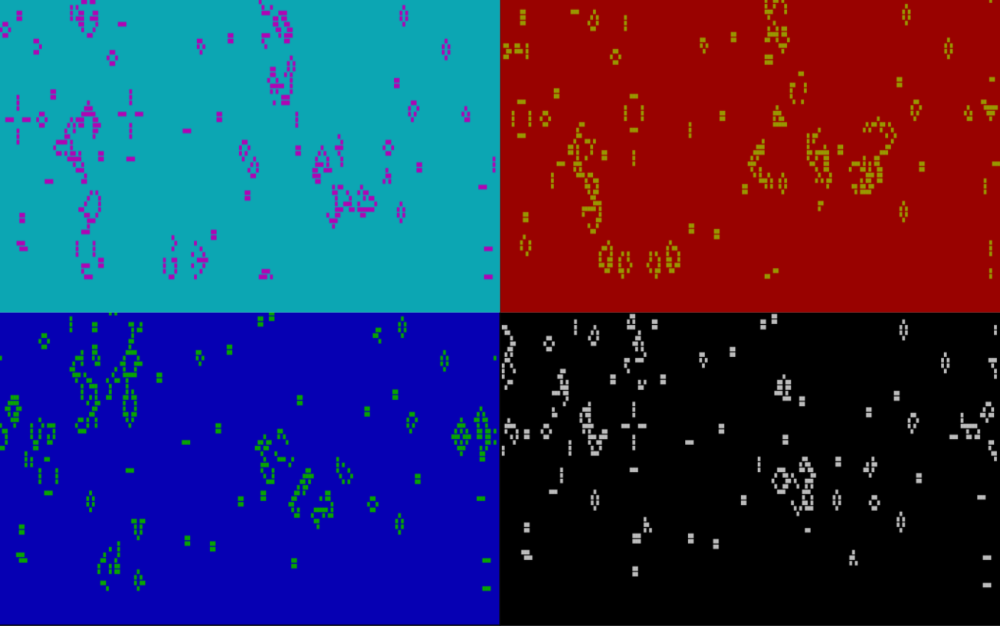

# gol

[](https://github.com/psf/black)
[](https://pycqa.github.io/isort/)

A simple game of life implementation in vanilla python and using curses.

This was a project was made for entertainment purposes and in order
to have something nice to look at in a terminal from time to time.

## Usage

`gol` is intended to be a command line tool. Once installed, simply run `gol` in your
terminal (hopefully you have `xterm-256color` enabled).

Running the following command will yield something like what you see in the images below.

```bash
gol
```



It is also possible to specify the game's intial setup as shown in the following output:

```bash
$ gol --help
usage: gol [-h] [--seed SEED] [--threshold THRESHOLD] [--interval INTERVAL]

Conway's game of life.
Welcome to the 0 player game in which all you have to do is look.
If you do want to play a bit, you can interact with life with the following keys:
	* p : pause life at a given iteration. To resume, enter p again.
	* (1|2|3|4) : toggle the color scheme.
	* q : Exit the program.

optional arguments:
  -h, --help            show this help message and exit
  --seed SEED           The seed to initiate life. Defaults to 1.
  --threshold THRESHOLD
                        A float between 0 and 1. Used to determine whether a value will lead to a dead or alive cell.
  --interval INTERVAL   The refresh interval rate between generations in seconds. Defaults to 1s.
```

## Install

It is recommended that you use a [virtual environment](https://docs.python.org/3/tutorial/venv.html)
to install `gol`.

In your virtual environment, simply run `pip install .` and `gol` should be a command in your path.

## Build

You can build the project as a traditional python package (using `wheel` and `setuptools`) or as
an executable file with `pyinstaller`. For this, install the project's development dependencies
with `pip install '.[dev]'`.

To build the project's wheel distribution, run `make build` (or `python setup.py sdist bdist_wheel`
if you are on Windows).

To build the project as an executable, run `make build-exe` (or `pyinstaller gol.py` if you are
on Windows). The executable should be `dist/gol/gol`.

## Development

To develop this project:

* fork the repository
* create a virtual environment
* install the development dependencies
* install the pre-commit hooks with `pre-commit install`
* get started on your development!
